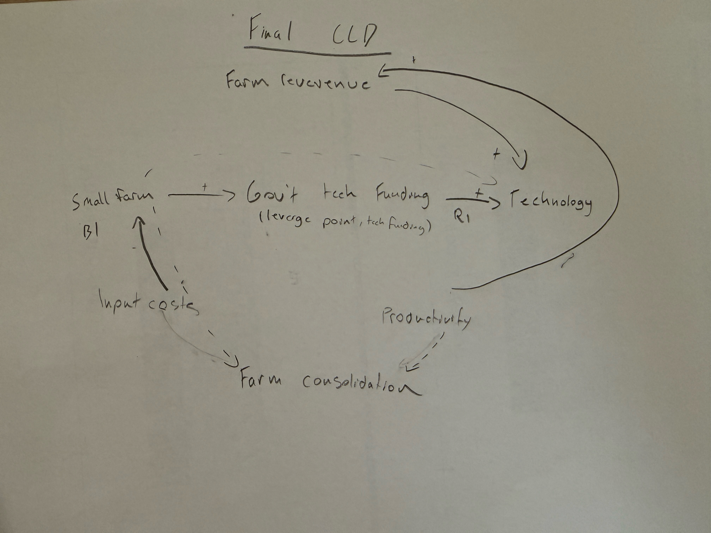

# OntarioFarms: Funding Technology for Small Farms or Scaling Large-Farm Returns?

## 1) Project Title and Decision Statement
**Decision statement:** Should Ontario prioritize public funding for technology adoption on **small farms** to improve equity and long-term resilience, or continue emphasizing investments in **large farms** that often produce stronger short-term returns per public dollar?

---

## 2) Executive Summary
Ontario agriculture is at a policy crossroads. Existing system patterns suggest that farms with higher revenues can reinvest in technology faster, improve productivity, and continue compounding gains. Smaller farms, meanwhile, often face tighter margins and rising input costs, making technology adoption harder without targeted support. This creates a structural gap over time, not simply a management gap.

Our system-dynamics framing shows how this gap can reinforce farm consolidation. A reinforcing loop links revenue, technology adoption, and productivity growth for better-capitalized farms, while a balancing pressure on smaller farms (high input costs and limited investable surplus) can trap them in underinvestment. In this context, government technology funding functions as a key leverage point: it can interrupt entrenched dynamics and improve adoption among farms currently constrained by financing barriers.

Based on the milestone evidence in this repository, the recommended direction is to prioritize targeted technology support for smaller farms (with implementation support, not just financing), while monitoring long-run outcomes such as farm-count diversity, resilience, and resource sustainability in addition to short-run output.

---

## 3) Table of Contents
- [1) Project Title and Decision Statement](#1-project-title-and-decision-statement)
- [2) Executive Summary](#2-executive-summary)
- [3) Table of Contents](#3-table-of-contents)
- [4) Background](#4-background)
- [5) Data Sources](#5-data-sources)
- [6) Exploratory Findings](#6-exploratory-findings)
- [7) System Dynamics](#7-system-dynamics)
- [8) Analysis (Milestone 3)](#8-analysis-milestone-3)
- [9) Recommendations](#9-recommendations)
- [10) Limitations and Future Work](#10-limitations-and-future-work)
- [11) References](#11-references)

---

## 4) Background
For the full narrative, see **[Background.md](Background.md)**.

In brief, Ontario's funding decision has consequences for:
- Farm viability across size classes,
- Rural economic health,
- Food-system resilience,
- Public return-on-investment over both short and long time horizons.

Stakeholders include small and medium farms, large commercial producers, technology providers, rural communities, consumers, and provincial funders.

---

## 5) Data Sources
Primary datasets used in milestone work:
- **Statistics Canada: Revenues and Expenses**  
  `Milestone2/data/statcan_revenues_expenses_32-10-0136-01.csv`
- **Statistics Canada: Technology Use**  
  `Milestone2/data/statcan_tech_use_32-10-0379-01.csv`
- **Statistics Canada: Direct Payments**  
  `Milestone2/data/statcan_direct_payments_32-10-0106-01.csv`
- **Statistics Canada: Farm Area**  
  `Milestone2/data/tatcan_farm_area_32-10-0156-01.csv`

Data-preparation notes: see **[Milestone2/Wrangling.md](Milestone2/Wrangling.md)**.

---

## 6) Exploratory Findings
Key exploratory takeaways from milestone outputs:
- Small farms face stronger cost pressure and weaker ability to self-finance technology upgrades.
- Larger farms show stronger revenue growth and more capacity to reinvest, reinforcing productivity advantages.
- Over time, these patterns align with increasing consolidation risk if policy remains size-neutral in practice.

### Example visualization

> Tip: Additional images are available in `/img` and `Milestone2/img/` directories.

---

## 7) System Dynamics
The project’s final causal reasoning focuses on feedback loops connecting:
- Farm revenue,
- Technology adoption,
- Productivity,
- Input costs,
- Small-farm viability.

Interpretation summary:
- A **reinforcing loop** accelerates growth for farms already positioned to invest.
- A **constraint loop** can trap smaller farms in chronic underinvestment.
- **Targeted technology funding** is treated as the leverage point capable of changing both dynamics.

For full write-up, see **[Milestone4/FinalCLD](Milestone4/FinalCLD)**.

### CLD visual

---

## 8) Analysis (Milestone 3)
Milestone 3 contributions are documented in:
- **[Milestone3/Archetype](Milestone3/Archetype)**
- **[Milestone3/Leverage point analysis](Milestone3/Leverage point analysis)**
- **[Milestone3/Three scenario narratives](Milestone3/Three scenario narratives)**
- **[Milestone3/Clear connection](Milestone3/Clear connection)**

High-level synthesis:
- Large-farm-focused funding produces strong early gains but raises long-run system pressure.
- Small-farm technology support starts slower but can improve diversity and resilience.
- A hybrid strategy can reduce trade-off severity but may not fully resolve underlying reinforcing dynamics.

---

## 9) Recommendations
1. Create a **dedicated small-farm technology grant stream** (not loan-only support).
2. Pair financing with **extension/implementation support** to improve real adoption.
3. Publish **annual monitoring indicators** (farm counts by size, adoption rates, and resilience metrics).
4. Conduct **10- and 20-year comparative cost-benefit analysis** for funding strategies.

Detailed recommendation text: **[Milestone4/DecisionRecommendations](Milestone4/DecisionRecommendations)**.

---

## 10) Limitations and Future Work
Current limitations:
- Evidence is constrained by available historical indicators and milestone scope.
- Some relevant drivers (land access, market access, succession, localized climate risk) are not modeled in depth.
- Technology support alone may be insufficient if structural barriers persist.

Future work priorities:
- Add stronger environmental/resource metrics to scenario testing.
- Expand validation with stakeholder interviews and regional comparisons.
- Prototype policy simulations that test grant design alternatives and adoption behavior.

---

## 11) References
- Agricultural Research Program funding. Ontario.ca. https://www.ontario.ca/page/agricultural-research-program-funding
- Farming & Agri-Food in Ontario: 30 Facts. Canada Action. https://www.canadaaction.ca/ontario-farming-facts
- IFAD: Why small farms are key to the future of food. https://www.ifad.int/en/web/latest/-/blog/why-small-farms-are-key-to-the-future-of-food-and-how-we-can-support-them

Additional project references and supporting notes appear across milestone files in this repository.
